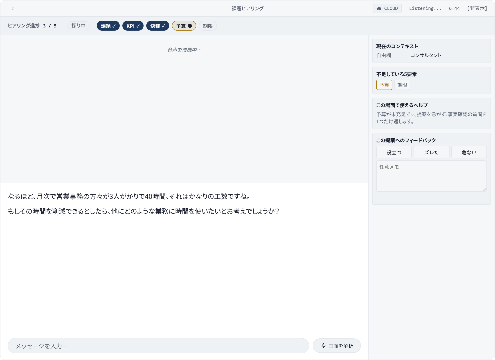

<p align="center">
  <picture>
    <source media="(prefers-color-scheme: dark)" srcset="docs/brand/logo-mark-dark.svg" />
    
  </picture>
</p>

# WhisperOhKAMI

> **「次は、予算を聞いて」 — 商談中、横でささやく Windows デスクトップ AI**
>
> Whispering copilot for Japanese B2B sales discovery (商談ヒアリング).
>
> **LP / Download**: <https://whisperohkami.pages.dev> · 自己責任でご利用ください。

<p align="center">
  <a href="https://whisperohkami.pages.dev">
    
  </a>
</p>

## 何をするのか

商談中の相手の発話を聞き取って、5 つの確認したい要素 (**課題 / KPI / 決裁 / 予算 / 期限**) のうち **まだ聞けていない要素を色で気づかせます**。固定のセリフや応答候補は提示しません。**頭が真っ白になっても、横で「次の一手」を耳打ちする** — そんな設計です。

精度を上げたいときは BYOK モードで Gemini を繋ぐと、語彙のゆれ(例:「KPIにしても良いかな」「来期の予算」)も意味カテゴリとして拾い直してくれます。`trial` モードと、`byok` で Deepgram キーを入力し設定 →「音声認識エンジン」で「クラウド優先」を選んでいるときは、Gemini が応答しなくても決まった単語パターンの即時判定で動き続けます（`local` モードでは進捗バーは動きません）。

各要素の状態は次の 5 段です。

| 状態               | 意味                                                            |
| ------------------ | --------------------------------------------------------------- |
| 未確認             | まだ話題に出ていない                                            |
| 探り中             | 関連する言葉は出たが、具体的な中身はまだ                        |
| 候補（仮・要確認） | 値は出たが仮・未合意、または食い違う値がある                    |
| 候補あり（未確認） | 会話上の肯定的な根拠がある（相手への確認はまだ）                |
| 確認済み（✓）      | 利用者が相手に確認して ✓ を押した（自動では確認済みにしません） |

外部の検証では『会話上の肯定根拠がある』状態を confirmed と呼びますが、本アプリではそれは『候補あり（未確認）』にあたり、『確認済み』は利用者が相手に確認して ✓ を押した状態だけを指します。

## 3 つのモード

起動後のメイン画面（またはオンボーディング）でモードを切り替えます。**既定は `trial`（キー不要）**。

| モード              | キー            | 文字起こし                                                  | 進捗バー                                                           | AI 応答                                         |
| ------------------- | --------------- | ----------------------------------------------------------- | ------------------------------------------------------------------ | ----------------------------------------------- |
| **trial** (既定)    | 不要            | マイクのみ、端末内 Whisper (既定 Small)。話者は区別しません | 動く（候補検出。自分の発言も相手の発言として扱う。確認済みは手動） | なし                                            |
| **byok**（検証中）  | Gemini API キー | Deepgram nova-3 (任意) または Gemini Live                   | Deepgram キー＋「クラウド優先」選択時のみ                          | あり（Gemini 2.5 系は新規キーで動かない可能性） |
| **local**（検証中） | 不要 (Ollama)   | 端末内 Whisper (既定 Small)                                 | 動かない                                                           | Ollama（ホストがこの PC なら外部送信なし）      |

**お試し（`trial`）は話者を区別しません。** マイクに入った自分の発言も相手の発言として扱われるため、5 要素の候補には自分が口にした条件が混ざることがあります。候補は相手に確認してから ✓ を押してください。

外部サービスで対応しているのは **Google Gemini（AI キー）と Deepgram（文字起こし）の 2 つだけ**で、どちらも無料枠があります。無料枠を超えた分は各サービスからご自身に直接請求されます（料金や無料枠の条件は各サービスが変更することがあります）。OpenAI / Claude など、ほかの AI サービスのキーは使えません。

非エンジニアの方は、BYOK 画面の「🧭 はじめての方：ガイド付きで設定」から、キー取得〜貼り付け〜接続確認まで画面内ガイドで完了できます。

## 保存されるデータと削除

- 商談ごとの文字起こし・AI の助言・画面分析の結果は、この PC の `%APPDATA%\whisper-oh-kami-config\history` に**平文 JSON** で保存されます。**自動削除はありません**。
- 設定 →「プライバシーとデータ」→「すべてのデータを削除」は、この設定フォルダ全体（履歴・API キー・設定）と、旧バージョンの設定フォルダ `cheating-daddy-config` を削除します。
- API キーは Electron の safeStorage（Windows では DPAPI）で暗号化して `credentials.json` に保存します。暗号化が使えない環境では、キーをディスクに書かず、そのセッションの間だけメモリに保持します。
- Whisper モデルのキャッシュと、「サポート用に書き出す」で書き出したファイルは削除されません。

## セットアップ

```bash
npm install
npm start
```

`npm install` で依存をインストール、`npm start` で起動。初回起動時のオンボーディングで「はじめ方」を 3 モードから選びます（あとから設定でいつでも変更可）。配布版が欲しい方は [LP](https://whisperohkami.pages.dev) からどうぞ。

**動作環境**: Windows 主対象（macOS は限定検証、Linux はマイク入力のみ）。端末内 Whisper は CPU で動作（GPU 任意）。既定モデルは Small（tiny / small の両方をインストーラに同梱するため、インストーラサイズは従来の約 210 MB から約 400 MB に増えています）。低スペック PC では設定から Tiny に切り替え可能です。システム音声取り込み（画面共有 / loopback）+ マイクの OS 権限が必要。

## プライバシー・文字起こし

- **`trial` は端末内で完結**、**`local` は Ollama のホストがこの PC なら端末内で完結** — マイクや相手の音声、文字起こし結果を外部に送りません。`byok` モードでは、相手の音声が自分で設定した Gemini キー宛に Gemini Live（Google、米国）へ送信されます（設定の「Deepgram を使わない」を選んでも同じです）。**テレメトリはなし**（起動時に 1 回だけ `whisperohkami.pages.dev/api/release/latest` へ新しいバージョンの有無を確認します。送るのはバージョン番号の照会だけで、音声・文字起こし・設定は送りません）。
- **文字起こし**: 既定は端末内 Whisper Small（インストーラに同梱済み、初回起動時のダウンロード不要）。低スペック PC 向けに Tiny（同梱済み）へ切り替え可能。より高精度・日本語特化の任意オプションとして `onnx-community/kotoba-whisper-v2.2-ONNX`（Apache-2.0）も選べますが、同梱はしておらず初回選択時に Hugging Face から約 1 GB をダウンロードします（CPU では推論が遅くなるため、高性能 PC 向け）。Deepgram nova-3 は任意（BYOK 設定の Deepgram キー入力欄、または環境変数 `DEEPGRAM_API_KEY`）。Deepgram を使うと、音声は Deepgram（米国）にも送信されます。
- **自分の声と相手の声を分けて取り込み**（`byok`）: マイク（自分）と Windows ループバック（相手）を別々のチャネルで処理。**進捗バーは相手の発話だけを対象** にします。`trial` はマイクのみで話者を区別しないため、自分の発言も相手の発言として進捗バーの対象になります。
- **対応プロファイル**: Discovery / Sales の 2 種類（既定 `sales`）。日本語 B2B 商談向けにプロンプトを調整し、AI が提案や押し売り表現を出さないようにガードしています。

## 困ったときは

アプリ内 **ヘルプ →「よくある質問・困ったとき」** にトラブルシュート集約。バグ・要望は [GitHub Issues](https://github.com/kintaro1221/whisper-oh-kami/issues) へ、返事は best effort。

## ライセンス

WhisperOhKAMI は [sohzm/cheating-daddy](https://github.com/sohzm/cheating-daddy)（GPLv3）のフォークです。2026年5月以降 kintaro1221 が改変しています（GPLv3 §5(a) に基づく改変の告知。改変後のソース一式は配布物に同梱）。ライセンスは引き続き **GPL-3.0**（同梱の `LICENSE` に全文）。著作者 kintaro1221、ソースは [github.com/kintaro1221/whisper-oh-kami](https://github.com/kintaro1221/whisper-oh-kami)。依存パッケージライセンス一覧は `THIRD_PARTY_NOTICES.md` に、同梱フォント Noto Sans JP は SIL Open Font License 1.1 で提供。

---

## English

WhisperOhKAMI is a real-time **whispering** copilot for Japanese B2B sales discovery calls (商談). It shadow-displays which of the five discovery elements (Pain / KPI / Decision / Budget / Timing) are **still missing** from the opponent's speech — whispering "what to ask next" by color. No canned lines, no fixed talk-scripts: the rep keeps the conversation, the AI keeps the checklist by their side.

### Three modes

- **`trial`** (default, keyless) — on-device Whisper on the mic only + regex 5-element bar. No API key, no AI replies, nothing sent off-device. **No speaker separation**: your own words picked up by the mic are treated as the counterpart's, so the 5-element candidates can include conditions you said yourself. Confirm a candidate with the counterpart before pressing ✓.
- **`byok`** (beta) — your own Gemini key unlocks AI replies and LLM hybrid refinement. The counterpart's audio (system audio) is sent to Gemini Live (Google, US) with your key, even when Deepgram is turned off. The 5-element bar only moves when a Deepgram key is entered and "Prefer cloud" is selected under Settings → Speech recognition engine. The Gemini 2.5 series may not work with newly created keys.
- **`local`** (beta) — Ollama + on-device Whisper. Nothing leaves the device when the Ollama host is this PC (default 127.0.0.1); a remote Ollama host receives the transcripts. The 5-element bar does not move in this mode.

### Setup

```bash
npm install && npm start
```

Pick a mode in onboarding. Windows-first (macOS limited, Linux mic-only). Trial mode is fully keyless. The on-device Whisper Small model ships with the installer (tiny and small are both bundled, no first-run download; installer size is ~400 MB, up from ~210 MB). Switch to Tiny in settings on lower-spec machines; an optional high-accuracy, Japanese-tuned `onnx-community/kotoba-whisper-v2.2-ONNX` (Apache-2.0) model is also available but not bundled — it downloads ~1 GB from Hugging Face on first selection and is best suited to faster machines given its CPU inference cost.

### Privacy notes

- STT: on-device Whisper Small (default, bundled). Tiny (bundled) and the optional kotoba-whisper-v2.2-ONNX (Apache-2.0, downloaded on first use) are also available. Deepgram nova-3 is opt-in via the BYOK Deepgram key (or `DEEPGRAM_API_KEY`); cloud mode sends audio to Deepgram (US).
- Trial keeps audio on-device; local does too when the Ollama host is this PC (default 127.0.0.1). BYOK sends the counterpart's audio to Gemini Live (Google, US) and, when enabled, audio to Deepgram (US) — always with your own keys. No telemetry. The only call home is a one-time version check at startup (`whisperohkami.pages.dev/api/release/latest`); no audio, transcripts or settings are sent.
- API keys are encrypted with Electron safeStorage (DPAPI on Windows) before they are written to `credentials.json`. Where encryption is unavailable, keys are never written to disk; they are kept in memory for the current session only.
- Profiles: `discovery` / `sales` only (default `sales`); JP-tuned prompts that ban proposing or scripted talk.

WhisperOhKAMI is a fork of [sohzm/cheating-daddy](https://github.com/sohzm/cheating-daddy) (GPLv3), modified by kintaro1221 since May 2026 (notice per GPLv3 §5(a); the complete modified source ships alongside every binary). Licensed under GPL-3.0. Source at [github.com/kintaro1221/whisper-oh-kami](https://github.com/kintaro1221/whisper-oh-kami).
